# ServiceOps — System Architecture

> **Status:** v0.1 — architectural baseline
> **Audience:** engineers, ops, founders
> **Scope:** ServiceOps platform → folds into MobiWave Core
> **Last updated:** 2026-06-08

---

## 0. Vision & Constraints

**What we are building**

ServiceOps is a multi-tenant operations platform for service agencies in East Africa. Day-one verticals:

- Domestic cleaning (one-off, weekly, deep clean)
- House-help placement (interview → match → payroll)
- Laundry pickup / delivery
- Caregiving (elderly, post-natal, child)
- Pest control
- Property maintenance

The platform itself is the product. The same code, the same database, the same ops dashboard runs a 5-cleaner agency in Nyali and a 200-staff caregiving firm in Nairobi. Tenant configuration does the rest.

**What we are not building (yet)**

- A consumer marketplace (no "find me a cleaner near me" search engine)
- A CRM in the Twenty/HubSpot sense — we have a thin customer record, not pipelines
- A replacement for WhatsApp — we integrate with it
- Native mobile apps — PWA only until post-MVP
- Cal.com, Novu, Budibase, NocoDB, Invoice Ninja, Keycloak, Twenty, n8n, OSRM, PostHog, Directus

**Stack (locked for MVP)**

| Layer | Choice | Why |
|---|---|---|
| Frontend | Next.js 15 (App Router, RSC) | Single codebase, route groups, server actions |
| API | Node.js + Express 5 (or Fastify) | Simple, well-known, easy to hire for |
| Language | TypeScript strict | Everywhere. No `any`. |
| ORM | Prisma | Schema-as-source-of-truth, great migrations |
| Database | PostgreSQL 16 | tstzrange, exclusion constraints, RLS, JSONB |
| Cache / queue | Redis 7 + BullMQ | Idempotency cache, job queue, locks |
| Object storage | MinIO (S3-compatible) | Self-hosted, swap to S3/R2 later |
| Auth | NextAuth (phone OTP) | Day 1. Keycloak when B2B demands it. |
| SMS | Africa's Talking | Kenya + Uganda + Tanzania coverage |
| WhatsApp | WhatsApp Cloud API (direct) | Novu is overkill for MVP |
| Email | Resend | Best DX, generous free tier |
| Payments | M-Pesa Daraja via Lipana wrapper | Faster than building B2C/STK from scratch |
| Observability | Sentry + pino + OpenTelemetry | Day 1. Non-negotiable. |
| Background jobs | BullMQ workers in same repo | Cron, M-Pesa recon, WhatsApp retries |
| Hosting | Single Hetzner VPS to start | 4 vCPU / 16 GB / 200 GB NVMe |
| CI/CD | GitHub Actions → Docker → VPS | No Kubernetes until 50+ tenants |

**Architectural principles (the constitution)**

1. **Own the business model.** Users, bookings, jobs, payments live in our DB. External systems are replaceable adapters.
2. **Treat every external call as eventually-delivered or never-delivered.** Outbox pattern. No synchronous coupling.
3. **Multi-tenant data model from line 1.** Enforce via RLS later. Don't retrofit.
4. **Money is integer minor units. Always.** No floats, no decimals in code.
5. **No `DELETE` in production.** Soft delete + PII redaction.
6. **Every state transition is auditable.** Actor, from, to, at, reason.
7. **Idempotency keys on every mutation.** Not just payments.
8. **Offline-first for workers.** Local queue, sync on reconnect, conflict resolution.
9. **Job types are an enum, not separate tables.** ServiceOps scales by adding enum values + service config.
10. **Single Next.js codebase.** Route groups for personas, not separate apps.

---

## 1. System Context (C4 Level 1)

The system in its environment. Who uses it, what it talks to.

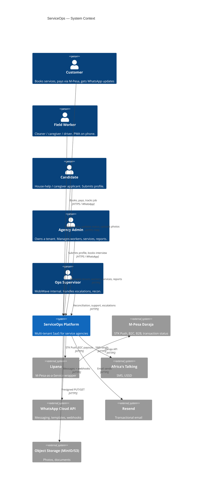
```mermaid
C4Context
    title ServiceOps — System Context

    Person(customer, "Customer", "Books services, pays via M-Pesa, gets WhatsApp updates")
    Person(worker, "Field Worker", "Cleaner / caregiver / driver. PWA on phone.")
    Person(candidate, "Candidate", "House-help / caregiver applicant. Submits profile.")
    Person(admin, "Agency Admin", "Owns a tenant. Manages workers, services, reports.")
    Person(ops, "Ops Supervisor", "MobiWave internal. Handles escalations, recon.")

    System(serviceops, "ServiceOps Platform", "Multi-tenant SaaS for service agencies")

    System_Ext(mpesa, "M-Pesa Daraja", "STK Push, B2C, B2B, transaction status")
    System_Ext(lipana, "Lipana", "M-Pesa-as-a-Service wrapper")
    System_Ext(africastalking, "Africa's Talking", "SMS, USSD")
    System_Ext(whatsapp, "WhatsApp Cloud API", "Messaging, templates, webhooks")
    System_Ext(resend, "Resend", "Transactional email")
    System_Ext(s3, "Object Storage (MinIO/S3)", "Photos, documents")

    Rel(customer, serviceops, "Books, pays, tracks job", "HTTPS / WhatsApp")
    Rel(worker, serviceops, "Accepts jobs, updates status, uploads photos", "HTTPS PWA")
    Rel(candidate, serviceops, "Submits profile, books interview", "HTTPS / WhatsApp")
    Rel(admin, serviceops, "Manages tenant, workers, services, reports", "HTTPS")
    Rel(ops, serviceops, "Reconciliation, support, escalations", "HTTPS")

    Rel(serviceops, lipana, "STK Push, B2C payouts", "HTTPS")
    Rel(lipana, mpesa, "Daraja API", "HTTPS")
    Rel(serviceops, africastalking, "SMS sends", "HTTPS")
    Rel(serviceops, whatsapp, "Messages + webhooks", "HTTPS")
    Rel(serviceops, resend, "Email sends", "HTTPS")
    Rel(serviceops, s3, "Presigned PUT/GET", "HTTPS")
```

**Key insight:** All inbound customer touchpoints funnel into the same Express API. The browser, the PWA, and the WhatsApp bot are all clients. The API and DB are the source of truth.

---

## 2. Container Architecture (C4 Level 2)

The deployable units and their responsibilities.

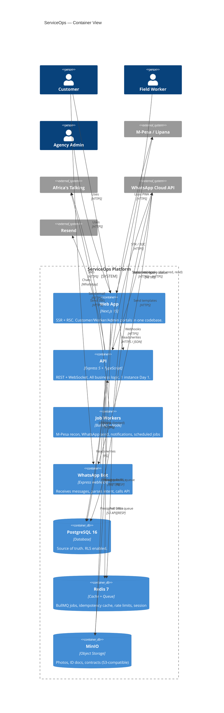
```mermaid
C4Container
    title ServiceOps — Container View

    Person(customer, "Customer", "")
    Person(worker, "Field Worker", "")
    Person(admin, "Agency Admin", "")

    System_Boundary(c1, "ServiceOps Platform") {
        Container(web, "Web App", "Next.js 15", "SSR + RSC. Customer/Worker/Admin portals in one codebase.")
        Container(api, "API", "Express 5 + TypeScript", "REST + WebSocket. All business logic. 1 instance Day 1.")
        Container(worker_q, "Job Workers", "BullMQ + Node", "M-Pesa recon, WhatsApp send, notifications, scheduled jobs")
        Container(whatsapp_bot, "WhatsApp Bot", "Express webhook", "Receives messages, parses intent, calls API")
        ContainerDb(postgres, "PostgreSQL 16", "Database", "Source of truth. RLS enabled.")
        ContainerDb(redis, "Redis 7", "Cache + Queue", "BullMQ jobs, idempotency cache, rate limits, session")
        ContainerDb(minio, "MinIO", "Object Storage", "Photos, ID docs, contracts (S3-compatible)")
    }

    System_Ext(mpesa, "M-Pesa / Lipana", "")
    System_Ext(at, "Africa's Talking", "")
    System_Ext(wa, "WhatsApp Cloud API", "")
    System_Ext(email, "Resend", "")

    Rel(customer, web, "Uses", "HTTPS")
    Rel(worker, web, "Uses PWA", "HTTPS")
    Rel(admin, web, "Uses", "HTTPS")
    Rel(customer, whatsapp_bot, "Chats", "WhatsApp")
    Rel(whatsapp_bot, api, "Calls", "HTTPS")

    Rel(web, api, "Reads/writes", "HTTPS / JSON")
    Rel(web, postgres, "SSR data (limited)", "PG")
    Rel(web, minio, "Presigned URLs", "HTTPS")
    Rel(api, postgres, "Reads/writes", "PG")
    Rel(api, redis, "Cache, locks, queue", "RESP")
    Rel(api, minio, "Presigned URLs", "S3 API")
    Rel(api, mpesa, "STK / B2C", "HTTPS")
    Rel(api, at, "SMS", "HTTPS")
    Rel(api, wa, "Send messages", "HTTPS")
    Rel(api, email, "Send email", "HTTPS")

    Rel(worker_q, postgres, "Process jobs", "PG")
    Rel(worker_q, redis, "Pull from queue", "RESP")
    Rel(worker_q, mpesa, "Reconcile, query status", "HTTPS")
    Rel(worker_q, wa, "Send templates", "HTTPS")
    Rel(worker_q, at, "Send SMS", "HTTPS")

    Rel(wa, whatsapp_bot, "Webhooks", "HTTPS")
    Rel(wa, api, "Status webhooks (delivered, read)", "HTTPS")
```

**Deployment topology (Day 1, single VPS)**

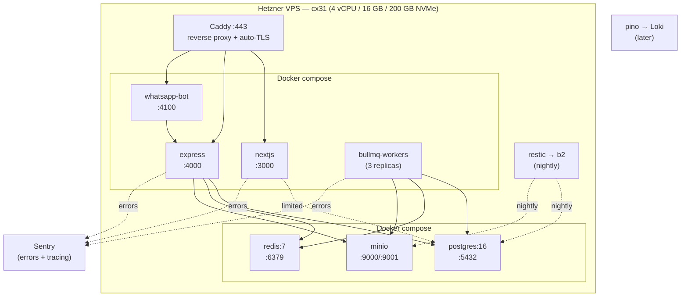
```mermaid
flowchart TB
    subgraph vps["Hetzner VPS — cx31 (4 vCPU / 16 GB / 200 GB NVMe)"]
        direction TB
        caddy["Caddy :443<br/>reverse proxy + auto-TLS"]
        subgraph apps["Docker compose"]
            web["nextjs<br/>:3000"]
            api["express<br/>:4000"]
            bot["whatsapp-bot<br/>:4100"]
            workers["bullmq-workers<br/>(3 replicas)"]
        end
        subgraph data["Docker compose"]
            pg["postgres:16<br/>:5432"]
            redis["redis:7<br/>:6379"]
            minio["minio<br/>:9000/:9001"]
        end
        backup["restic → b2<br/>(nightly)"]
    end
    sentry["Sentry<br/>(errors + tracing)"]
    pg_logs["pino → Loki<br/>(later)"]

    caddy --> web
    caddy --> api
    caddy --> bot
    api --> pg
    api --> redis
    api --> minio
    workers --> pg
    workers --> redis
    workers --> minio
    web -.->|limited| pg
    bot --> api
    backup -.->|nightly| pg
    backup -.->|nightly| minio

    api -.->|errors| sentry
    web -.->|errors| sentry
    workers -.->|errors| sentry
```

---

## 3. Data Model

### 3.1 Core ERD

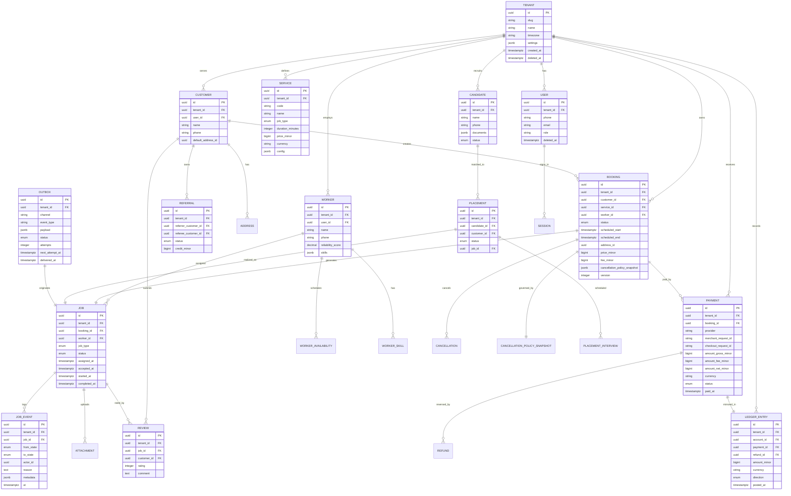
```mermaid
erDiagram
    TENANT ||--o{ USER : has
    TENANT ||--o{ SERVICE : defines
    TENANT ||--o{ BOOKING : owns
    TENANT ||--o{ WORKER : employs
    TENANT ||--o{ CUSTOMER : serves
    TENANT ||--o{ CANDIDATE : recruits
    TENANT ||--o{ PAYMENT : receives
    TENANT ||--o{ LEDGER_ENTRY : records

    CUSTOMER ||--o{ BOOKING : creates
    CUSTOMER ||--o{ REVIEW : submits
    CUSTOMER ||--o{ REFERRAL : owns
    CUSTOMER ||--o{ ADDRESS : has

    WORKER ||--o{ JOB : assigned
    WORKER ||--o{ WORKER_AVAILABILITY : schedules
    WORKER ||--o{ WORKER_SKILL : has

    BOOKING ||--|| JOB : generates
    BOOKING ||--o{ PAYMENT : paid_by
    BOOKING ||--o{ CANCELLATION : cancels
    BOOKING ||--|| CANCELLATION_POLICY_SNAPSHOT : governed_by

    JOB ||--o{ JOB_EVENT : logs
    JOB ||--o{ ATTACHMENT : uploads
    JOB ||--o{ REVIEW : rated_by

    CANDIDATE ||--o{ PLACEMENT : matched_to
    PLACEMENT ||--o{ PLACEMENT_INTERVIEW : scheduled
    PLACEMENT ||--|| JOB : realized_as

    PAYMENT ||--|| LEDGER_ENTRY : mirrored_in
    PAYMENT ||--o{ REFUND : reversed_by

    OUTBOX ||--|| JOB : originates

    USER ||--o{ SESSION : signs_in

    TENANT {
        uuid id PK
        string slug
        string name
        string timezone
        jsonb settings
        timestamptz created_at
        timestamptz deleted_at
    }
    USER {
        uuid id PK
        uuid tenant_id FK
        string phone
        string email
        string role
        timestamptz deleted_at
    }
    CUSTOMER {
        uuid id PK
        uuid tenant_id FK
        uuid user_id FK
        string name
        string phone
        uuid default_address_id
    }
    WORKER {
        uuid id PK
        uuid tenant_id FK
        uuid user_id FK
        string name
        string phone
        decimal reliability_score
        jsonb skills
    }
    SERVICE {
        uuid id PK
        uuid tenant_id FK
        string code
        string name
        enum job_type
        integer duration_minutes
        bigint price_minor
        string currency
        jsonb config
    }
    BOOKING {
        uuid id PK
        uuid tenant_id FK
        uuid customer_id FK
        uuid service_id FK
        uuid worker_id FK
        enum status
        timestamptz scheduled_start
        timestamptz scheduled_end
        uuid address_id
        bigint price_minor
        bigint fee_minor
        jsonb cancellation_policy_snapshot
        integer version
    }
    JOB {
        uuid id PK
        uuid tenant_id FK
        uuid booking_id FK
        uuid worker_id FK
        enum job_type
        enum status
        timestamptz assigned_at
        timestamptz accepted_at
        timestamptz started_at
        timestamptz completed_at
    }
    PAYMENT {
        uuid id PK
        uuid tenant_id FK
        uuid booking_id FK
        string provider
        string merchant_request_id
        string checkout_request_id
        bigint amount_gross_minor
        bigint amount_fee_minor
        bigint amount_net_minor
        string currency
        enum status
        timestamptz paid_at
    }
    LEDGER_ENTRY {
        uuid id PK
        uuid tenant_id FK
        uuid account_id FK
        uuid payment_id FK
        uuid refund_id FK
        bigint amount_minor
        string currency
        enum direction
        timestamptz posted_at
    }
    REVIEW {
        uuid id PK
        uuid tenant_id FK
        uuid job_id FK
        uuid customer_id FK
        integer rating
        text comment
    }
    REFERRAL {
        uuid id PK
        uuid tenant_id FK
        uuid referrer_customer_id FK
        uuid referee_customer_id FK
        enum status
        bigint credit_minor
    }
    CANDIDATE {
        uuid id PK
        uuid tenant_id FK
        string name
        string phone
        jsonb documents
        enum status
    }
    PLACEMENT {
        uuid id PK
        uuid tenant_id FK
        uuid candidate_id FK
        uuid customer_id FK
        enum status
        uuid job_id FK
    }
    OUTBOX {
        uuid id PK
        uuid tenant_id FK
        string channel
        string event_type
        jsonb payload
        enum status
        integer attempts
        timestamptz next_attempt_at
        timestamptz delivered_at
    }
    JOB_EVENT {
        uuid id PK
        uuid tenant_id FK
        uuid job_id FK
        enum from_state
        enum to_state
        uuid actor_id
        text reason
        jsonb metadata
        timestamptz at
    }
```

### 3.2 Critical constraints

```sql
-- Concurrency: no two CONFIRMED/IN_PROGRESS bookings for the same worker
ALTER TABLE bookings ADD CONSTRAINT no_worker_double_book
  EXCLUDE USING gist (
    worker_id WITH =,
    tstzrange(scheduled_start, scheduled_end) WITH &&
  ) WHERE (status IN ('CONFIRMED', 'IN_PROGRESS'));

-- Idempotency: M-Pesa callbacks
ALTER TABLE payments ADD CONSTRAINT uniq_mpesa_callback
  UNIQUE (merchant_request_id, checkout_request_id);

-- Outbox: at-least-once delivery, no duplicates within retry window
ALTER TABLE outbox ADD CONSTRAINT uniq_outbox_event
  UNIQUE (event_type, event_key);

-- Soft delete: every domain table
ALTER TABLE users ADD COLUMN deleted_at TIMESTAMPTZ;
ALTER TABLE customers ADD COLUMN deleted_at TIMESTAMPTZ;
ALTER TABLE workers ADD COLUMN deleted_at TIMESTAMPTZ;
ALTER TABLE bookings ADD COLUMN deleted_at TIMESTAMPTZ;
ALTER TABLE jobs ADD COLUMN deleted_at TIMESTAMPTZ;

-- Optimistic concurrency on hot rows
ALTER TABLE bookings ADD COLUMN version INTEGER NOT NULL DEFAULT 1;
```

### 3.3 Multi-tenancy strategy

**Data model:** `tenant_id UUID NOT NULL` on every domain table from migration #1.

**Enforcement (Day 1, all environments):** Postgres Row-Level Security.

```sql
-- Per-table policy template
ALTER TABLE bookings ENABLE ROW LEVEL SECURITY;

CREATE POLICY tenant_isolation_bookings ON bookings
  USING (tenant_id = current_setting('app.tenant_id', true)::uuid);

-- Force policy even for table owners (prevents accidental bypass)
ALTER TABLE bookings FORCE ROW LEVEL SECURITY;
```

**Application glue:** API middleware extracts `tenant_id` from the JWT, then:

```sql
-- On every connection check-out from the pool
SET LOCAL app.tenant_id = '...uuid...';
SET LOCAL app.user_id = '...uuid...';
SET LOCAL app.user_role = 'admin';
```

Prisma middleware refuses to run a query without these set, throws `TenantContextMissingError`.

**Cross-tenant test:** Every query path has a test that asserts `tenant_id = B` cannot read `tenant_id = A` rows. No exceptions.

### 3.4 Migration strategy

- Prisma Migrate for schema changes
- Migrations live in `apps/api/prisma/migrations/`
- All migrations are **forward-only** in production. Never edit applied migrations.
- Destructive changes follow expand → migrate → contract:
  1. Add new column (nullable)
  2. Backfill via background job
  3. Switch reads to new column
  4. Drop old column (separate migration)
- `prisma migrate diff` checked into CI for review

---

## 4. State Machines

The lifecycles that make or break the system.

### 4.1 Booking lifecycle

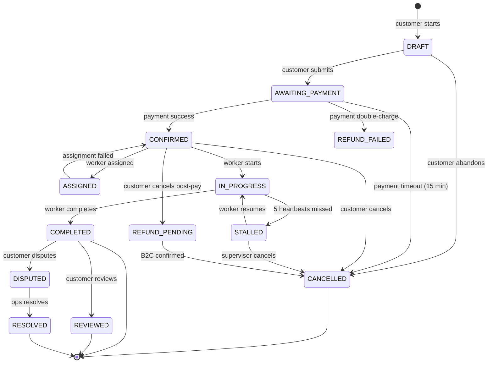
```mermaid
stateDiagram-v2
    [*] --> DRAFT: customer starts
    DRAFT --> AWAITING_PAYMENT: customer submits
    DRAFT --> CANCELLED: customer abandons
    AWAITING_PAYMENT --> CONFIRMED: payment success
    AWAITING_PAYMENT --> CANCELLED: payment timeout (15 min)
    AWAITING_PAYMENT --> REFUND_FAILED: payment double-charge
    CONFIRMED --> ASSIGNED: worker assigned
    ASSIGNED --> CONFIRMED: assignment failed
    CONFIRMED --> IN_PROGRESS: worker starts
    CONFIRMED --> CANCELLED: customer cancels
    CONFIRMED --> REFUND_PENDING: customer cancels post-pay
    IN_PROGRESS --> COMPLETED: worker completes
    IN_PROGRESS --> STALLED: 5 heartbeats missed
    STALLED --> IN_PROGRESS: worker resumes
    STALLED --> CANCELLED: supervisor cancels
    COMPLETED --> REVIEWED: customer reviews
    COMPLETED --> DISPUTED: customer disputes
    DISPUTED --> RESOLVED: ops resolves
    CANCELLED --> [*]
    REFUND_PENDING --> CANCELLED: B2C confirmed
    COMPLETED --> [*]
    REVIEWED --> [*]
    RESOLVED --> [*]
```

**Allowed transitions** are encoded in code, not just docs. A `transition()` function takes `(booking, toState, actor, reason)` and throws `InvalidTransitionError` if disallowed. Every transition writes a `job_event` row in the same transaction.

### 4.2 Job lifecycle

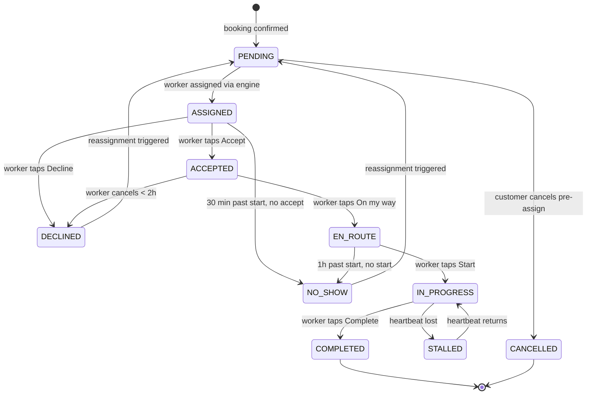
```mermaid
stateDiagram-v2
    [*] --> PENDING: booking confirmed
    PENDING --> ASSIGNED: worker assigned via engine
    ASSIGNED --> ACCEPTED: worker taps Accept
    ASSIGNED --> DECLINED: worker taps Decline
    ASSIGNED --> NO_SHOW: 30 min past start, no accept
    ACCEPTED --> EN_ROUTE: worker taps On my way
    ACCEPTED --> DECLINED: worker cancels < 2h
    EN_ROUTE --> IN_PROGRESS: worker taps Start
    EN_ROUTE --> NO_SHOW: 1h past start, no start
    IN_PROGRESS --> COMPLETED: worker taps Complete
    IN_PROGRESS --> STALLED: heartbeat lost
    STALLED --> IN_PROGRESS: heartbeat returns
    DECLINED --> PENDING: reassignment triggered
    NO_SHOW --> PENDING: reassignment triggered
    PENDING --> CANCELLED: customer cancels pre-assign
    COMPLETED --> [*]
    CANCELLED --> [*]
```

### 4.3 Payment lifecycle

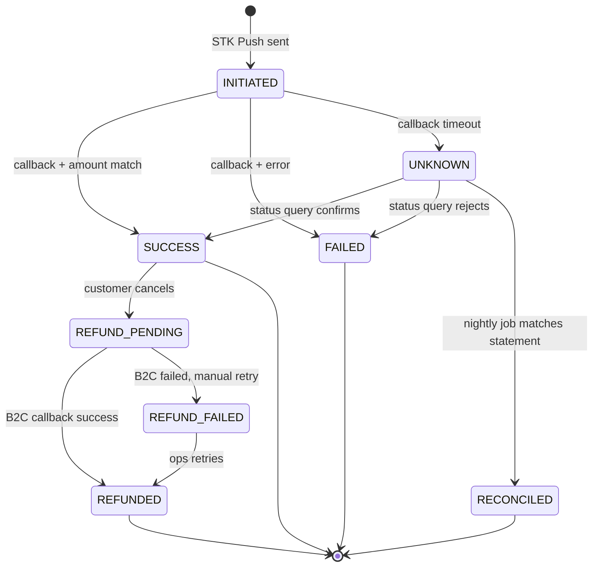
```mermaid
stateDiagram-v2
    [*] --> INITIATED: STK Push sent
    INITIATED --> SUCCESS: callback + amount match
    INITIATED --> FAILED: callback + error
    INITIATED --> UNKNOWN: callback timeout
    UNKNOWN --> SUCCESS: status query confirms
    UNKNOWN --> FAILED: status query rejects
    UNKNOWN --> RECONCILED: nightly job matches statement
    SUCCESS --> REFUND_PENDING: customer cancels
    REFUND_PENDING --> REFUNDED: B2C callback success
    REFUND_PENDING --> REFUND_FAILED: B2C failed, manual retry
    REFUND_FAILED --> REFUNDED: ops retries
    SUCCESS --> [*]
    FAILED --> [*]
    REFUNDED --> [*]
    RECONCILED --> [*]
```

### 4.4 Outbox message lifecycle

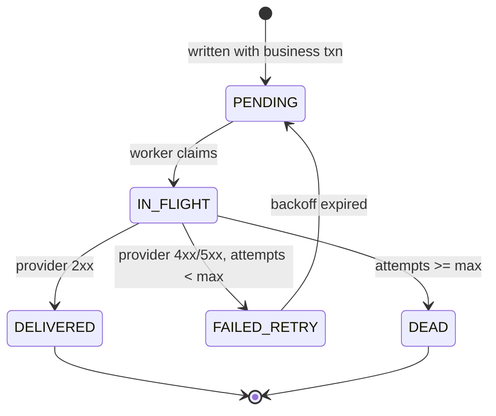
```mermaid
stateDiagram-v2
    [*] --> PENDING: written with business txn
    PENDING --> IN_FLIGHT: worker claims
    IN_FLIGHT --> DELIVERED: provider 2xx
    IN_FLIGHT --> FAILED_RETRY: provider 4xx/5xx, attempts < max
    FAILED_RETRY --> PENDING: backoff expired
    IN_FLIGHT --> DEAD: attempts >= max
    DELIVERED --> [*]
    DEAD --> [*]
```

---

## 5. Module Architecture (Backend)

### 5.1 Layout

```
apps/api/
├── src/
│   ├── modules/
│   │   ├── auth/
│   │   │   ├── auth.controller.ts
│   │   │   ├── auth.service.ts
│   │   │   ├── auth.repository.ts
│   │   │   ├── auth.types.ts
│   │   │   └── auth.policy.ts
│   │   ├── tenant/
│   │   ├── customer/
│   │   ├── worker/
│   │   ├── service-catalog/
│   │   ├── booking/
│   │   │   ├── booking.controller.ts
│   │   │   ├── booking.service.ts
│   │   │   ├── booking.repository.ts
│   │   │   ├── booking.policy.ts
│   │   │   ├── booking.fsm.ts        # state machine
│   │   │   ├── booking.queries.ts    # search/list
│   │   │   └── __tests__/
│   │   ├── job/
│   │   ├── assignment/                # dispatch engine
│   │   ├── payment/
│   │   │   ├── mpesa/
│   │   │   ├── ledger/
│   │   │   └── refund/
│   │   ├── notification/
│   │   │   ├── channels/
│   │   │   │   ├── sms.ts
│   │   │   │   ├── whatsapp.ts
│   │   │   │   └── email.ts
│   │   │   └── outbox/
│   │   ├── review/
│   │   ├── referral/
│   │   ├── placement/
│   │   ├── file/
│   │   └── audit/
│   ├── shared/
│   │   ├── db/
│   │   │   ├── prisma.ts
│   │   │   └── tenant-context.ts
│   │   ├── queue/
│   │   ├── events/
│   │   ├── http/
│   │   ├── auth/
│   │   ├── money/
│   │   ├── time/
│   │   ├── errors/
│   │   ├── logger/
│   │   └── observability/
│   ├── workers/
│   │   ├── mpesa-reconciliation.worker.ts
│   │   ├── whatsapp-sender.worker.ts
│   │   ├── notification-dispatcher.worker.ts
│   │   ├── outbox-drain.worker.ts
│   │   └── index.ts
│   ├── routes/
│   ├── app.ts
│   └── server.ts
├── prisma/
│   ├── schema.prisma
│   ├── migrations/
│   └── seed.ts
└── package.json
```

### 5.2 Module pattern (every module follows this)

```typescript
// booking.controller.ts — HTTP boundary
export const bookingController = {
  async create(req, res) {
    const result = await bookingService.create({
      tenantId: req.ctx.tenantId,
      actor: req.ctx.user,
      input: req.body,
    });
    res.status(201).json(result);
  },
};

// booking.service.ts — business rules
export async function createBooking(ctx, input) {
  return withTransaction(async (tx) => {
    // 1. Validate
    const customer = await customerRepo.findActive(tx, ctx.tenantId, input.customerId);
    if (!customer) throw new NotFoundError('customer');
    const service = await serviceRepo.findByCode(tx, ctx.tenantId, input.serviceCode);
    
    // 2. Create booking in PENDING_PAYMENT
    const booking = await bookingRepo.insert(tx, {
      tenantId: ctx.tenantId,
      customerId: customer.id,
      serviceId: service.id,
      status: 'AWAITING_PAYMENT',
      scheduledStart: input.scheduledStart,
      scheduledEnd: addMinutes(input.scheduledStart, service.durationMinutes),
      priceMinor: service.priceMinor,
      feeMinor: calculateFee(service, input),
      cancellationPolicySnapshot: service.cancellationPolicy,
      version: 1,
    });
    
    // 3. Write outbox event in same transaction
    await outboxRepo.append(tx, {
      tenantId: ctx.tenantId,
      channel: 'in_app',
      eventType: 'booking.created',
      eventKey: booking.id,
      payload: { bookingId: booking.id, customerId: customer.id },
    });
    
    // 4. Return — payment init happens in a separate call
    return booking;
  });
}
```

### 5.3 Inter-module rules

- Modules **never** import another module's repository directly. They go through that module's service.
- Cross-module events go through the **outbox**, not in-process function calls. This means a notification sent when a booking is confirmed is durable across API restarts.
- A module exposes a `policy.ts` (who can call what) and a `types.ts` (DTOs). Those are the public surface.

---

## 6. Key Flows

### 6.1 Booking creation (happy path)

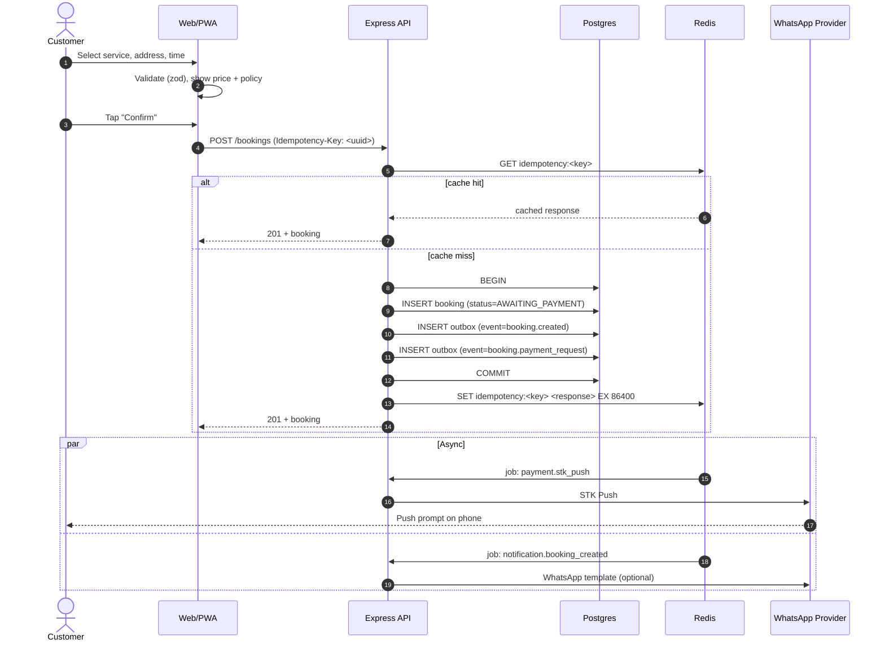
```mermaid
sequenceDiagram
    autonumber
    actor C as Customer
    participant W as Web/PWA
    participant API as Express API
    participant DB as Postgres
    participant Q as Redis
    participant WP as WhatsApp Provider

    C->>W: Select service, address, time
    W->>W: Validate (zod), show price + policy
    C->>W: Tap "Confirm"
    W->>API: POST /bookings (Idempotency-Key: <uuid>)
    API->>Q: GET idempotency:<key>
    alt cache hit
        Q-->>API: cached response
        API-->>W: 201 + booking
    else cache miss
        API->>DB: BEGIN
        API->>DB: INSERT booking (status=AWAITING_PAYMENT)
        API->>DB: INSERT outbox (event=booking.created)
        API->>DB: INSERT outbox (event=booking.payment_request)
        API->>DB: COMMIT
        API->>Q: SET idempotency:<key> <response> EX 86400
        API-->>W: 201 + booking
    end
    
    par Async
        Q->>API: job: payment.stk_push
        API->>WP: STK Push
        WP-->>C: Push prompt on phone
    and
        Q->>API: job: notification.booking_created
        API->>WP: WhatsApp template (optional)
    end
```

### 6.2 M-Pesa payment with idempotency

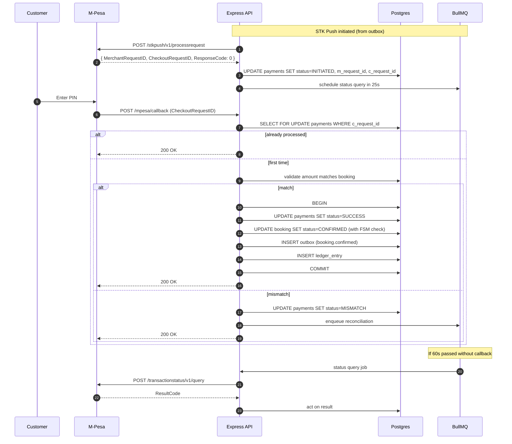
```mermaid
sequenceDiagram
    autonumber
    participant C as Customer
    participant MP as M-Pesa
    participant API as Express API
    participant DB as Postgres
    participant Q as BullMQ

    Note over API,Q: STK Push initiated (from outbox)
    API->>MP: POST /stkpush/v1/processrequest
    MP-->>API: { MerchantRequestID, CheckoutRequestID, ResponseCode: 0 }
    API->>DB: UPDATE payments SET status=INITIATED, m_request_id, c_request_id
    API->>Q: schedule status query in 25s

    C->>MP: Enter PIN
    MP->>API: POST /mpesa/callback (CheckoutRequestID)
    API->>DB: SELECT FOR UPDATE payments WHERE c_request_id
    alt already processed
        API-->>MP: 200 OK
    else first time
        API->>DB: validate amount matches booking
        alt match
            API->>DB: BEGIN
            API->>DB: UPDATE payments SET status=SUCCESS
            API->>DB: UPDATE booking SET status=CONFIRMED (with FSM check)
            API->>DB: INSERT outbox (booking.confirmed)
            API->>DB: INSERT ledger_entry
            API->>DB: COMMIT
            API-->>MP: 200 OK
        else mismatch
            API->>DB: UPDATE payments SET status=MISMATCH
            API->>Q: enqueue reconciliation
            API-->>MP: 200 OK
        end
    end

    Note over Q: If 60s passed without callback
    Q->>API: status query job
    API->>MP: POST /transactionstatus/v1/query
    MP-->>API: ResultCode
    API->>DB: act on result
```

### 6.3 Worker assignment (engine v1)

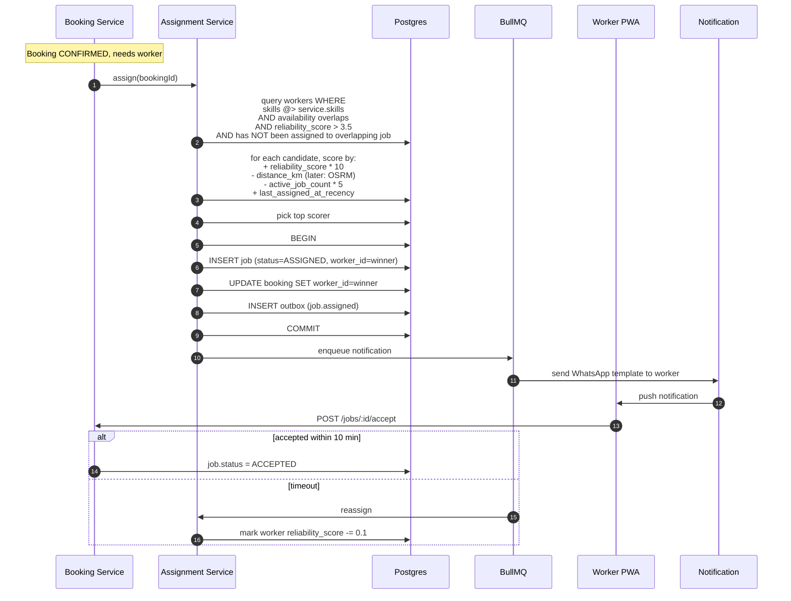
```mermaid
sequenceDiagram
    autonumber
    participant API as Booking Service
    participant AS as Assignment Service
    participant DB as Postgres
    participant Q as BullMQ
    participant W as Worker PWA
    participant N as Notification

    Note over API: Booking CONFIRMED, needs worker
    API->>AS: assign(bookingId)
    AS->>DB: query workers WHERE<br/>skills @> service.skills<br/>AND availability overlaps<br/>AND reliability_score > 3.5<br/>AND has NOT been assigned to overlapping job
    AS->>DB: for each candidate, score by:<br/>+ reliability_score * 10<br/>- distance_km (later: OSRM)<br/>- active_job_count * 5<br/>+ last_assigned_at_recency
    AS->>DB: pick top scorer
    AS->>DB: BEGIN
    AS->>DB: INSERT job (status=ASSIGNED, worker_id=winner)
    AS->>DB: UPDATE booking SET worker_id=winner
    AS->>DB: INSERT outbox (job.assigned)
    AS->>DB: COMMIT
    AS->>Q: enqueue notification
    Q->>N: send WhatsApp template to worker
    N->>W: push notification
    W->>API: POST /jobs/:id/accept
    alt accepted within 10 min
        API->>DB: job.status = ACCEPTED
    else timeout
        Q->>AS: reassign
        AS->>DB: mark worker reliability_score -= 0.1
    end
```

### 6.4 Cancellation with refund

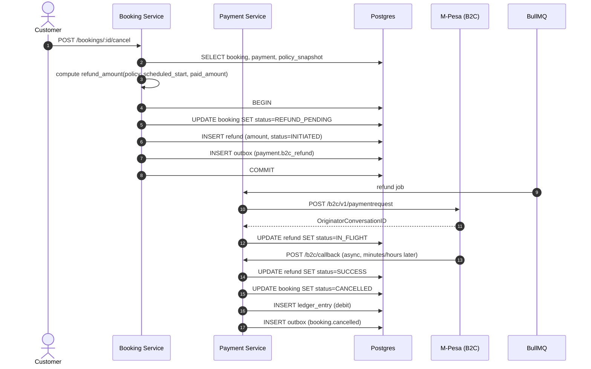
```mermaid
sequenceDiagram
    autonumber
    actor C as Customer
    participant API as Booking Service
    participant P as Payment Service
    participant DB as Postgres
    participant MP as M-Pesa (B2C)
    participant Q as BullMQ

    C->>API: POST /bookings/:id/cancel
    API->>DB: SELECT booking, payment, policy_snapshot
    API->>API: compute refund_amount(policy, scheduled_start, paid_amount)
    API->>DB: BEGIN
    API->>DB: UPDATE booking SET status=REFUND_PENDING
    API->>DB: INSERT refund (amount, status=INITIATED)
    API->>DB: INSERT outbox (payment.b2c_refund)
    API->>DB: COMMIT
    
    Q->>P: refund job
    P->>MP: POST /b2c/v1/paymentrequest
    MP-->>P: OriginatorConversationID
    P->>DB: UPDATE refund SET status=IN_FLIGHT
    MP->>P: POST /b2c/callback (async, minutes/hours later)
    P->>DB: UPDATE refund SET status=SUCCESS
    P->>DB: UPDATE booking SET status=CANCELLED
    P->>DB: INSERT ledger_entry (debit)
    P->>DB: INSERT outbox (booking.cancelled)
```

### 6.5 Worker offline sync

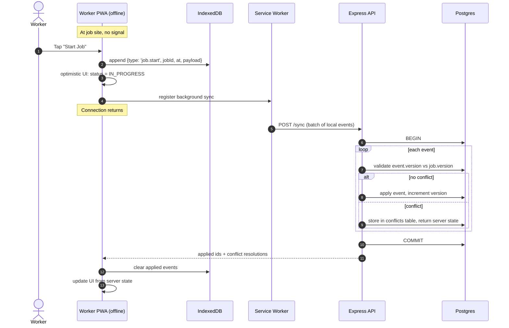
```mermaid
sequenceDiagram
    autonumber
    actor W as Worker
    participant App as Worker PWA (offline)
    participant IDB as IndexedDB
    participant SW as Service Worker
    participant API as Express API
    participant DB as Postgres

    Note over App: At job site, no signal
    W->>App: Tap "Start Job"
    App->>IDB: append {type: 'job.start', jobId, at, payload}
    App->>App: optimistic UI: status = IN_PROGRESS
    App->>SW: register background sync
    
    Note over App: Connection returns
    SW->>API: POST /sync (batch of local events)
    API->>DB: BEGIN
    loop each event
        API->>DB: validate event.version vs job.version
        alt no conflict
            API->>DB: apply event, increment version
        else conflict
            API->>DB: store in conflicts table, return server state
        end
    end
    API->>DB: COMMIT
    API-->>App: applied ids + conflict resolutions
    App->>IDB: clear applied events
    App->>App: update UI from server state
```

### 6.6 Nightly M-Pesa reconciliation

```mermaid
sequenceDiagram
    autonumber
    participant Q as BullMQ cron (3 AM EAT)
    participant API as Recon Service
    participant MP as M-Pesa
    participant DB as Postgres

    Q->>API: reconcileYesterday()
    API->>MP: GET /transactionstatus/v1/query (loop over yesterday's CheckoutRequestIDs)
    MP-->>API: list of confirmed transactions
    API->>DB: SELECT payments WHERE created_at >= yesterday
    API->>API: diff gateway vs DB
    loop for each difference
        alt gateway has, DB doesn't
            API->>DB: INSERT missing payment, confirm booking
        alt DB has, gateway doesn't
            API->>DB: mark payment UNKNOWN, queue ops review
        alt amount mismatch
            API->>DB: queue ops review with both records
        end
    end
    API->>DB: INSERT recon_audit_log
```

---

## 7. Cross-Cutting Concerns

### 7.1 Outbox pattern

The rule: every external call is initiated from a row in `outbox`, written in the same transaction as the business state change. A worker drains the outbox.

```sql
CREATE TABLE outbox (
  id              UUID PRIMARY KEY DEFAULT gen_random_uuid(),
  tenant_id       UUID NOT NULL,
  channel         TEXT NOT NULL,        -- 'whatsapp' | 'sms' | 'email' | 'mpesa_stk' | 'mpesa_b2c'
  event_type      TEXT NOT NULL,        -- 'booking.confirmed' | 'job.assigned' | ...
  event_key       TEXT NOT NULL,        -- idempotency key, e.g. booking_id
  payload         JSONB NOT NULL,
  status          TEXT NOT NULL DEFAULT 'pending',
  attempts        INT  NOT NULL DEFAULT 0,
  max_attempts    INT  NOT NULL DEFAULT 5,
  next_attempt_at TIMESTAMPTZ NOT NULL DEFAULT now(),
  delivered_at    TIMESTAMPTZ,
  last_error      TEXT,
  created_at      TIMESTAMPTZ NOT NULL DEFAULT now()
);

CREATE UNIQUE INDEX uniq_outbox_event ON outbox (event_type, event_key) WHERE status = 'pending';
```

**Drain worker pseudo-code:**

```typescript
// outbox-drain.worker.ts
while (true) {
  const claim = await db.query(`
    UPDATE outbox SET status = 'in_flight', attempts = attempts + 1
    WHERE id IN (
      SELECT id FROM outbox
      WHERE status = 'pending' AND next_attempt_at <= now()
      ORDER BY next_attempt_at
      LIMIT 10
      FOR UPDATE SKIP LOCKED
    )
    RETURNING *
  `);
  
  for (const msg of claim) {
    try {
      await dispatch(msg.channel, msg.payload);  // calls WhatsApp / M-Pesa / SMS
      await db.outbox.update(msg.id, { status: 'delivered', delivered_at: now() });
    } catch (err) {
      const next = backoff(msg.attempts);  // 1s, 5s, 30s, 5m, 30m
      if (msg.attempts >= msg.max_attempts) {
        await db.outbox.update(msg.id, { status: 'dead', last_error: err.message });
        await alertOps(msg);
      } else {
        await db.outbox.update(msg.id, {
          status: 'pending',
          next_attempt_at: addSeconds(now(), next),
          last_error: err.message,
        });
      }
    }
  }
  
  await sleep(500);
}
```

**The property this gives you:** if the API restarts mid-flow, the M-Pesa push still gets sent. If WhatsApp is down for 5 minutes, the message gets sent when it comes back. If a notification fails 5 times, it goes to `dead` and ops sees it. The business state in `bookings` and `payments` is **never** coupled to the synchronous success of an external call.

### 7.2 Idempotency

Every mutation endpoint accepts `Idempotency-Key: <uuid>` from the client. Server caches the response for 24h.

```typescript
// shared/http/idempotency.ts
export async function withIdempotency<T>(
  key: string,
  fn: () => Promise<T>
): Promise<T> {
  const cached = await redis.get(`idem:${key}`);
  if (cached) return JSON.parse(cached);
  
  const result = await fn();
  await redis.set(`idem:${key}`, JSON.stringify(result), 'EX', 86400);
  return result;
}
```

**Where it applies:** every `POST`, `PUT`, `PATCH` that mutates state. Not just payments.

### 7.3 Money

```typescript
// shared/money/money.ts
export class Money {
  constructor(
    public readonly minor: bigint,    // KES in smallest unit (no subunit, so 1 unit = 1 KES)
    public readonly currency: 'KES' | 'USD' = 'KES'
  ) {}
  
  static kes(amount: number | bigint | string): Money {
    return new Money(BigInt(amount), 'KES');
  }
  
  add(other: Money): Money {
    this.assertSameCurrency(other);
    return new Money(this.minor + other.minor, this.currency);
  }
  
  // ... full arithmetic
  
  toJSON() {
    return { minor: this.minor.toString(), currency: this.currency };
  }
}
```

**Rules:**
- Never `Number` for money in DB. Always `BIGINT`.
- Never `parseFloat` on API input. Parse as `bigint` or fail.
- API accepts money as `{ minor: "2500", currency: "KES" }`. Never decimals.
- Display layer formats: `(2500n).toLocaleString()` → `"2,500"`.

### 7.4 Soft delete + PII redaction

```typescript
// shared/db/soft-delete.ts
prisma.$use(async (params, next) => {
  if (params.model && SOFT_DELETE_MODELS.includes(params.model)) {
    if (params.action === 'delete') {
      params.action = 'update';
      params.args.data = { deleted_at: new Date() };
    }
    if (params.action === 'deleteMany') {
      params.action = 'updateMany';
      params.args.data = { deleted_at: new Date() };
    }
    if (params.action === 'findUnique' || params.action === 'findFirst') {
      params.args.where.deleted_at = null;
    }
    if (['findMany', 'count', 'aggregate'].includes(params.action)) {
      params.args.where = { ...params.args.where, deleted_at: null };
    }
  }
  return next(params);
});
```

**PII redaction (Kenya DPA request):**
```typescript
async function redactUser(userId: string) {
  await db.user.update({
    where: { id: userId },
    data: {
      name: `REDACTED-${hash(userId).slice(0, 8)}`,
      phone: '+0000000000',
      email: null,
      deleted_at: new Date(),
    },
  });
  // Historical bookings, jobs, payments keep user_id reference (audit trail)
  // The user is anonymized, not vaporized
}
```

### 7.5 Audit log

Every state transition writes a `job_event` (and equivalent for bookings, payments, refunds) row in the **same transaction** as the state change.

```typescript
// shared/audit/audit.ts
export async function recordTransition(
  tx: PrismaTx,
  args: {
    tenantId: string;
    entity: 'job' | 'booking' | 'payment' | 'refund';
    entityId: string;
    from: string | null;
    to: string;
    actorId: string;
    actorRole: string;
    reason?: string;
    metadata?: Record<string, unknown>;
  }
) {
  await tx.jobEvent.create({
    data: {
      tenant_id: args.tenantId,
      entity: args.entity,
      entity_id: args.entityId,
      from_state: args.from,
      to_state: args.to,
      actor_id: args.actorId,
      actor_role: args.actorRole,
      reason: args.reason,
      metadata: args.metadata ?? {},
    },
  });
}
```

The `job_event` table is **append-only**. No updates, no deletes. Partitioned monthly for query performance.

### 7.6 Observability

| Signal | Tool | Where |
|---|---|---|
| Errors | Sentry | API, web, workers, bot |
| Logs (structured) | pino → stdout | All services |
| Log aggregation | Loki (later, MVP = `journalctl -u`) | Host |
| Traces | OpenTelemetry → Sentry | API, workers |
| Metrics | Prometheus + Grafana (post-MVP) | Host |
| Uptime | BetterStack or UptimeRobot | External HTTP check |
| M-Pesa health | Custom dashboard on recon results | Admin |

**Required log fields:** `timestamp`, `level`, `tenant_id`, `request_id`, `user_id`, `route`, `latency_ms`, `error_code`.

**Required Sentry tags:** `tenant_id`, `route`, `entity_type`, `entity_id`.

### 7.7 Security

- **TLS everywhere.** Caddy auto-cert via Let's Encrypt.
- **Secrets** in `.env` on the host, not in the repo. Loaded into containers at runtime.
- **JWT secrets** rotated quarterly. Re-signing handled by NextAuth.
- **Rate limits** at the Caddy layer (basic) + per-tenant in Redis (5 req/s baseline, 1 req/s on payment endpoints).
- **Webhook signature verification** for M-Pesa, WhatsApp, Lipana. Reject on signature mismatch.
- **Presigned URLs** for MinIO with 5-minute expiry. Bucket is `public: false`.
- **CSP** strict on the web app. No third-party scripts.
- **PII at rest** encrypted via Postgres TDE or column-level encryption for `phone`, `email`, `id_number` on candidates.
- **Audit on access:** every read of a candidate's ID document is logged.

---

## 8. Frontend System

### 8.1 Application structure

```
apps/web/
├── app/
│   ├── (public)/                 # unauthenticated
│   │   ├── layout.tsx
│   │   ├── page.tsx              # landing
│   │   ├── services/
│   │   │   ├── page.tsx
│   │   │   └── [slug]/page.tsx
│   │   ├── pricing/page.tsx
│   │   ├── contact/page.tsx
│   │   └── auth/
│   │       ├── sign-in/page.tsx
│   │       ├── sign-up/page.tsx
│   │       └── verify/page.tsx
│   ├── (customer)/               # authenticated customer
│   │   ├── layout.tsx            # customer shell, auth guard
│   │   ├── dashboard/page.tsx
│   │   ├── services/page.tsx
│   │   ├── book/
│   │   │   ├── page.tsx
│   │   │   ├── service/page.tsx
│   │   │   ├── schedule/page.tsx
│   │   │   ├── address/page.tsx
│   │   │   ├── review/page.tsx
│   │   │   └── confirm/page.tsx
│   │   ├── bookings/
│   │   │   ├── page.tsx
│   │   │   └── [id]/page.tsx
│   │   ├── payments/page.tsx
│   │   ├── referrals/page.tsx
│   │   └── profile/page.tsx
│   ├── (worker)/                 # authenticated worker (PWA)
│   │   ├── layout.tsx            # worker shell, PWA-aware
│   │   ├── jobs/
│   │   │   ├── page.tsx          # today's jobs + upcoming
│   │   │   ├── [id]/page.tsx     # job detail
│   │   │   └── [id]/check-in/page.tsx
│   │   ├── earnings/page.tsx
│   │   ├── schedule/page.tsx
│   │   └── profile/page.tsx
│   ├── (admin)/                  # authenticated admin
│   │   ├── layout.tsx
│   │   ├── dashboard/page.tsx
│   │   ├── bookings/
│   │   ├── customers/
│   │   ├── workers/
│   │   ├── services/
│   │   ├── payments/
│   │   ├── placements/
│   │   ├── reports/
│   │   └── settings/
│   ├── api/                      # Next.js route handlers
│   │   ├── auth/[...nextauth]/route.ts
│   │   ├── webhooks/
│   │   │   ├── mpesa/route.ts
│   │   │   └── whatsapp/route.ts
│   │   └── cron/
│   │       └── reconcile/route.ts
│   ├── layout.tsx                # root
│   └── globals.css
├── components/
│   ├── ui/                       # shadcn/ui base
│   ├── forms/
│   ├── domain/
│   │   ├── booking/
│   │   ├── job/
│   │   ├── payment/
│   │   └── worker/
│   └── layout/
├── lib/
│   ├── api/                      # API client (server + client variants)
│   ├── auth/
│   ├── validation/               # zod schemas
│   ├── hooks/
│   ├── stores/                   # zustand for client state
│   ├── offline/                  # IndexedDB + sync queue
│   └── utils/
├── public/
│   ├── manifest.webmanifest
│   ├── icons/
│   └── sw.js                     # injected by next-pwa
├── styles/
└── next.config.ts
```

### 8.2 Route groups & layout strategy


```mermaid
flowchart TD
    Root["/ (root layout)<br/>html, providers, fonts, i18n"]
    Root --> Public["(public)<br/>public marketing layout"]
    Root --> Customer["(customer)<br/>auth guard, customer nav, footer"]
    Root --> Worker["(worker)<br/>auth guard, PWA shell, bottom nav"]
    Root --> Admin["(admin)<br/>auth guard, sidebar nav, role gate"]
    Root --> API["api/*<br/>route handlers, no UI"]
    
    Public --> Landing["/ landing"]
    Public --> Services["/services, /services/[slug]"]
    Public --> Pricing["/pricing"]
    Public --> Contact["/contact"]
    Public --> Auth["/auth/sign-in, /auth/sign-up, /auth/verify"]
    
    Customer --> Dash["/dashboard"]
    Customer --> Book["/book (5-step funnel)"]
    Customer --> Bookings["/bookings, /bookings/[id]"]
    Customer --> Payments["/payments"]
    Customer --> Referrals["/referrals"]
    Customer --> Profile["/profile"]
    
    Worker --> Jobs["/jobs, /jobs/[id]"]
    Worker --> Earnings["/earnings"]
    Worker --> Schedule["/schedule"]
    Worker --> Profile2["/profile"]
    
    Admin --> ADash["/dashboard"]
    Admin --> ABookings["/bookings"]
    Admin --> ACustomers["/customers"]
    Admin --> AWorkers["/workers"]
    Admin --> AServices["/services"]
    Admin --> APayments["/payments"]
    Admin --> APlacements["/placements"]
    Admin --> AReports["/reports"]
    Admin --> ASettings["/settings"]
```

**Key choice:** one codebase, three personas. Auth middleware reads the JWT role, redirects to the right group. No separate Next.js apps.

### 8.3 Component architecture

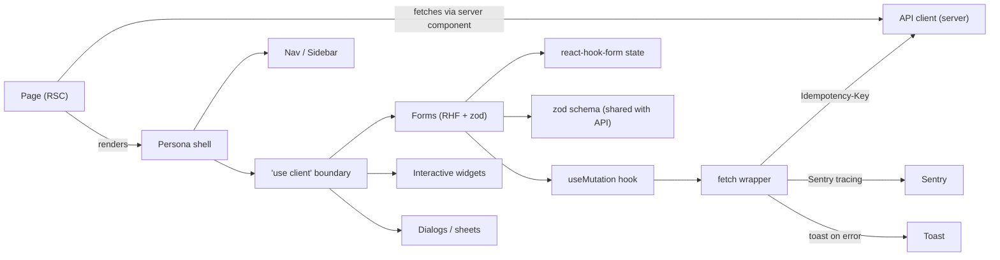
```mermaid
flowchart LR
    Page["Page (RSC)"] -->|"fetches via server component"| API["API client (server)"]
    Page -->|"renders"| Shell["Persona shell"]
    Shell --> Nav["Nav / Sidebar"]
    Shell --> ClientBoundary["'use client' boundary"]
    ClientBoundary --> Forms["Forms (RHF + zod)"]
    ClientBoundary --> Widgets["Interactive widgets"]
    ClientBoundary --> Modal["Dialogs / sheets"]
    
    Forms --> FormState["react-hook-form state"]
    Forms --> Validation["zod schema (shared with API)"]
    Forms --> Mutation["useMutation hook"]
    
    Mutation --> APIClient["fetch wrapper"]
    APIClient -->|"Idempotency-Key"| API
    APIClient -->|"Sentry tracing"| Sentry
    APIClient -->|"toast on error"| Toast
```

**Component rules:**

1. **Server Components by default.** Mark `'use client'` only at the leaves that need state.
2. **Forms:** React Hook Form + zod. Zod schema is the single source of truth — shared with the API for validation. Reuse, never duplicate.
3. **Mutations:** custom `useMutation` hook wrapping `fetch` with idempotency, error toast, optimistic update, and Sentry tracing.
4. **Lists:** server-fetched RSC. Pagination via URL search params (not state).
5. **Modals:** URL-driven (search param `?modal=...`). Back/forward works. Bookmarkable.
6. **shadcn/ui** as the base. Customize sparingly. Tailwind for everything.
7. **No state management library for server data.** Use RSC + revalidation. TanStack Query is **only** for the PWA offline queue.

### 8.4 State management

| State type | Tool | Why |
|---|---|---|
| Server data | RSC + `revalidatePath` | One-trip, fresh, no client cache to maintain |
| Form state | React Hook Form | Standard, great DX, validation integrated |
| UI state (modals, tabs) | URL search params | Bookmarkable, back-button-friendly |
| Auth session | NextAuth `useSession` | Built-in |
| Notifications (toast) | sonner | One provider, dismissible |
| Optimistic updates | `useOptimistic` (React 19) | Built-in, no library |
| Offline queue (worker PWA) | IndexedDB + TanStack Query sync | Only place we need a client cache |
| Cart-like flow state (booking funnel) | zustand | Cross-step state, persists across navigation |

### 8.5 API client

```typescript
// lib/api/client.ts (browser)
import { v4 as uuid } from 'uuid';

export class ApiClient {
  constructor(private baseUrl: string, private tenantSlug: string) {}
  
  async request<T>(method: string, path: string, body?: unknown, options?: { idempotencyKey?: string }): Promise<T> {
    const key = options?.idempotencyKey ?? (method !== 'GET' ? uuid() : undefined);
    
    const res = await fetch(`${this.baseUrl}${path}`, {
      method,
      headers: {
        'Content-Type': 'application/json',
        'Idempotency-Key': key,
        'X-Tenant': this.tenantSlug,
        'Authorization': `Bearer ${await getToken()}`,
      },
      body: body ? JSON.stringify(body) : undefined,
    });
    
    if (!res.ok) {
      const error = await res.json().catch(() => ({}));
      throw new ApiError(res.status, error.code, error.message);
    }
    
    return res.json();
  }
  
  get<T>(path: string) { return this.request<T>('GET', path); }
  post<T>(path: string, body?: unknown, key?: string) { return this.request<T>('POST', path, body, { idempotencyKey: key }); }
  put<T>(path: string, body?: unknown, key?: string) { return this.request<T>('PUT', path, body, { idempotencyKey: key }); }
  patch<T>(path: string, body?: unknown, key?: string) { return this.request<T>('PATCH', path, body, { idempotencyKey: key }); }
  delete<T>(path: string, key?: string) { return this.request<T>('DELETE', path, undefined, { idempotencyKey: key }); }
}
```

### 8.6 Auth flow

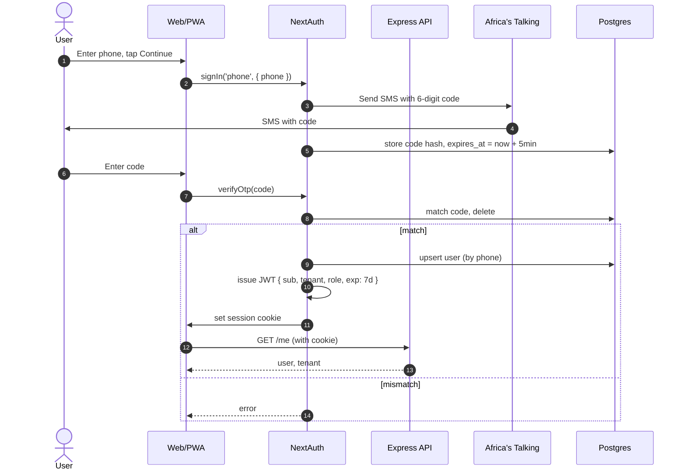
```mermaid
sequenceDiagram
    autonumber
    actor U as User
    participant W as Web/PWA
    participant NA as NextAuth
    participant API as Express API
    participant AT as Africa's Talking
    participant DB as Postgres

    U->>W: Enter phone, tap Continue
    W->>NA: signIn('phone', { phone })
    NA->>AT: Send SMS with 6-digit code
    AT->>U: SMS with code
    NA->>DB: store code hash, expires_at = now + 5min
    U->>W: Enter code
    W->>NA: verifyOtp(code)
    NA->>DB: match code, delete
    alt match
        NA->>DB: upsert user (by phone)
        NA->>NA: issue JWT { sub, tenant, role, exp: 7d }
        NA->>W: set session cookie
        W->>API: GET /me (with cookie)
        API-->>W: user, tenant
    else mismatch
        NA-->>W: error
    end
```

**Roles:** `customer`, `worker`, `admin`, `ops`. Set at signup or by tenant admin. RBAC checks both on the API (authoritative) and the UI (cosmetic, to hide unauthorized links).

### 8.7 Form strategy

**Single source of truth:** zod schema. Same schema on client (RHF resolver) and server (request validator).

```typescript
// lib/validation/booking.ts
export const createBookingSchema = z.object({
  serviceCode: z.string().min(1),
  scheduledStart: z.string().datetime(),  // ISO
  addressId: z.string().uuid(),
  notes: z.string().max(500).optional(),
}).refine(
  (d) => new Date(d.scheduledStart) > new Date(),
  { message: 'Scheduled time must be in the future', path: ['scheduledStart'] }
);

export type CreateBookingInput = z.infer<typeof createBookingSchema>;
```

```typescript
// components/forms/booking-form.tsx
'use client';
import { useForm } from 'react-hook-form';
import { zodResolver } from '@hookform/resolvers/zod';

export function BookingForm() {
  const form = useForm<CreateBookingInput>({
    resolver: zodResolver(createBookingSchema),
    defaultValues: { serviceCode: '', scheduledStart: '', addressId: '', notes: '' },
  });
  
  const mutation = useMutation({
    mutationFn: (input: CreateBookingInput) => apiClient.post('/bookings', input),
    onSuccess: (booking) => router.push(`/bookings/${booking.id}`),
  });
  
  return <form onSubmit={form.handleSubmit((d) => mutation.mutate(d))}>...</form>;
}
```

### 8.8 PWA / Offline (worker app)

The worker app is a PWA with offline-first behavior. The cleaner needs to see today's jobs and update status even with no signal.

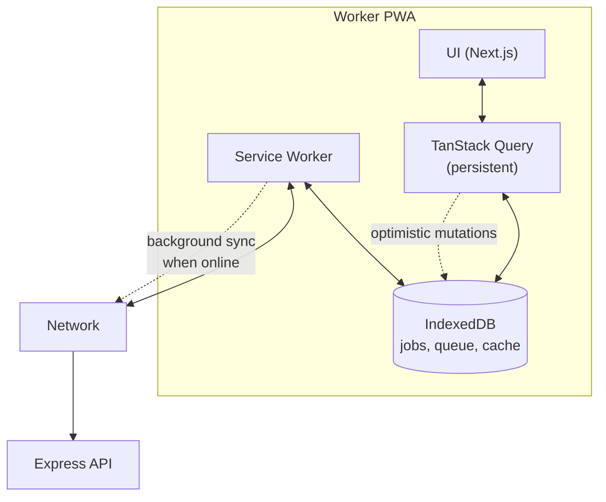
```mermaid
flowchart TB
    subgraph Browser["Worker PWA"]
        UI["UI (Next.js)"]
        SW["Service Worker"]
        IDB[("IndexedDB<br/>jobs, queue, cache")]
        TQ["TanStack Query<br/>(persistent)"]
    end
    
    UI <--> TQ
    TQ <--> IDB
    SW <--> IDB
    SW <--> Net["Network"]
    Net --> API["Express API"]
    
    SW -.->|"background sync<br/>when online"| Net
    TQ -.->|"optimistic mutations"| IDB
```

**Key patterns:**

1. **Service worker** registered for `/worker/*` only. Marketing pages don't need it.
2. **Cache-first for static assets**, network-first for `/api/worker/jobs*` with fallback to IndexedDB.
3. **Offline mutations queued** in IndexedDB. Service worker's `sync` event (or manual retry on `online` event) drains the queue.
4. **Conflict resolution** is server-authoritative. Client sends `last_known_version`; server returns `409` + current state if conflict.
5. **Install prompt** shown to new workers. App install icon on home screen.
6. **Push notifications** for new job assignments. Uses Web Push API with VAPID keys.

**Manifest essentials:**

```json
{
  "name": "ServiceOps Worker",
  "short_name": "ServiceOps",
  "start_url": "/worker",
  "display": "standalone",
  "background_color": "#ffffff",
  "theme_color": "#0f766e",
  "icons": [
    { "src": "/icons/192.png", "sizes": "192x192", "type": "image/png" },
    { "src": "/icons/512.png", "sizes": "512x512", "type": "image/png", "purpose": "any maskable" }
  ],
  "shortcuts": [
    { "name": "Today's Jobs", "url": "/worker/jobs" }
  ]
}
```

### 8.9 Theming & i18n

- **Theming:** Tailwind + CSS variables. Light/dark. Tenant-level brand color override via CSS var set on `<html>`.
- **i18n:** `next-intl`. English + Swahili Day 1. Strings in `messages/{en,sw}.json`. Server-rendered with locale in URL (`/sw/bookings`).
- **Currency:** formatted per tenant config (KES default). BigInt → string → `Intl.NumberFormat`.
- **Date/time:** `date-fns` + `date-fns-tz`. Always render in user's `home_timezone`.

### 8.10 Performance budget

| Page | Target LCP (p75) | Target TTI (p75) | JS budget |
|---|---|---|---|
| Landing | < 1.5s | < 2.0s | < 100 KB |
| Customer dashboard | < 1.5s | < 2.0s | < 150 KB |
| Booking funnel | < 1.5s | < 2.0s | < 150 KB |
| Worker job list | < 1.0s | < 1.5s | < 100 KB |
| Admin dashboard | < 2.0s | < 2.5s | < 250 KB |

**Enforcement:** Lighthouse CI in GitHub Actions, fails PR if budget exceeded.

---

## 9. Infrastructure & Deployment

### 9.1 Day-1 stack (single VPS)

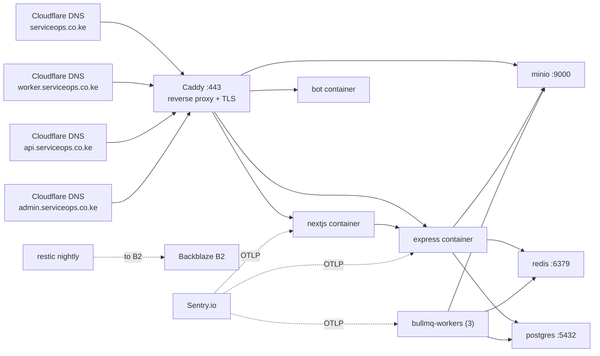
```mermaid
flowchart LR
    DNS["Cloudflare DNS<br/>serviceops.co.ke"] --> Caddy
    DNS2["Cloudflare DNS<br/>worker.serviceops.co.ke"] --> Caddy
    DNS3["Cloudflare DNS<br/>api.serviceops.co.ke"] --> Caddy
    DNS4["Cloudflare DNS<br/>admin.serviceops.co.ke"] --> Caddy
    
    Caddy["Caddy :443<br/>reverse proxy + TLS"] --> W["nextjs container"]
    Caddy --> A["express container"]
    Caddy --> B["bot container"]
    Caddy --> M["minio :9000"]
    
    W --> A
    A --> PG["postgres :5432"]
    A --> R["redis :6379"]
    A --> M
    WQ["bullmq-workers (3)"] --> PG
    WQ --> R
    WQ --> M
    
    Backup["restic nightly"] -.->|to B2| B2["Backblaze B2"]
    Sentry["Sentry.io"] -.->|OTLP| A
    Sentry -.->|OTLP| W
    Sentry -.->|OTLP| WQ
```

### 9.2 Service deployment (docker-compose)

```yaml
# docker-compose.yml (excerpt)
services:
  caddy:
    image: caddy:2
    volumes:
      - ./Caddyfile:/etc/caddy/Caddyfile
      - caddy_data:/data
    ports: ["80:80", "443:443"]
    depends_on: [web, api, bot, minio]
    restart: unless-stopped

  web:
    build: ./apps/web
    environment:
      - DATABASE_URL=${DATABASE_URL}
      - NEXTAUTH_SECRET=${NEXTAUTH_SECRET}
      - API_INTERNAL_URL=http://api:4000
    restart: unless-stopped

  api:
    build: ./apps/api
    environment:
      - DATABASE_URL=${DATABASE_URL}
      - REDIS_URL=${REDIS_URL}
      - LIPANA_API_KEY=${LIPANA_API_KEY}
      - MPESA_ENV=sandbox  # then production
      - WHATSAPP_TOKEN=${WHATSAPP_TOKEN}
      - AT_API_KEY=${AT_API_KEY}
      - RESEND_API_KEY=${RESEND_API_KEY}
      - SENTRY_DSN=${SENTRY_DSN}
    depends_on: [postgres, redis, minio]
    restart: unless-stopped

  bot:
    build: ./apps/bot
    environment:
      - API_INTERNAL_URL=http://api:4000
      - WHATSAPP_VERIFY_TOKEN=${WHATSAPP_VERIFY_TOKEN}
    depends_on: [api]
    restart: unless-stopped

  workers:
    build: ./apps/api
    command: ["node", "dist/workers/index.js"]
    environment:
      - DATABASE_URL=${DATABASE_URL}
      - REDIS_URL=${REDIS_URL}
    depends_on: [postgres, redis]
    deploy:
      replicas: 3
    restart: unless-stopped

  postgres:
    image: postgres:16
    volumes: [pgdata:/var/lib/postgresql/data]
    environment:
      - POSTGRES_PASSWORD=${POSTGRES_PASSWORD}
    restart: unless-stopped

  redis:
    image: redis:7
    command: ["redis-server", "--appendonly", "yes"]
    volumes: [redisdata:/data]
    restart: unless-stopped

  minio:
    image: minio/minio
    command: ["server", "/data", "--console-address", ":9001"]
    volumes: [miniodata:/data]
    environment:
      - MINIO_ROOT_USER=${MINIO_ROOT_USER}
      - MINIO_ROOT_PASSWORD=${MINIO_ROOT_PASSWORD}
    restart: unless-stopped

volumes:
  pgdata:
  redisdata:
  miniodata:
  caddy_data:
```

### 9.3 Backups

- **Postgres:** `pg_basebackup` daily + WAL archiving to Backblaze B2 via `restic`. Point-in-time recovery to 7 days.
- **MinIO:** `mc mirror` nightly to B2. Same restic bucket.
- **Config:** `docker-compose.yml`, `Caddyfile`, `.env`, Prisma migrations all in git.
- **Restore drill:** monthly. Documented runbook.

### 9.4 CI/CD

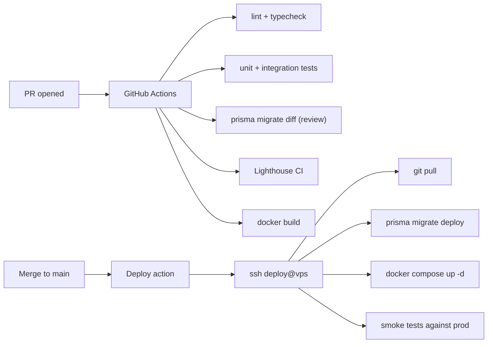
```mermaid
flowchart LR
    PR["PR opened"] --> CI["GitHub Actions"]
    CI --> Lint["lint + typecheck"]
    CI --> Test["unit + integration tests"]
    CI --> Migrations["prisma migrate diff (review)"]
    CI --> LH["Lighthouse CI"]
    CI --> Build["docker build"]
    
    main["Merge to main"] --> Deploy["Deploy action"]
    Deploy --> SSH["ssh deploy@vps"]
    SSH --> Pull["git pull"]
    SSH --> Migrate["prisma migrate deploy"]
    SSH --> Up["docker compose up -d"]
    SSH --> Smoke["smoke tests against prod"]
```

**No manual deploys.** Every change goes through main branch. Rollback = `git revert` + push.

### 9.5 Observability stack

| Signal | Day 1 | Post-MVP |
|---|---|---|
| Errors | Sentry (free tier) | Sentry (team plan) |
| Logs | pino → journalctl | pino → Loki |
| Metrics | none | Prometheus + Grafana |
| Uptime | UptimeRobot (free) | BetterStack |
| Tracing | Sentry basic | OpenTelemetry + Tempo |

---

## 10. Build Plan (Gantt)

8 weeks, MVP scope. Critical path runs through booking + M-Pesa. Laundry and placement start in parallel from Week 4.

```mermaid
gantt
    title ServiceOps MVP — Build Plan (8 weeks)
    dateFormat  YYYY-MM-DD
    axisFormat  %b %d

    section Foundation
    Monorepo + tooling + CI                :done,    foundation-1, 2026-06-09, 3d
    Postgres + Prisma + RLS                :         foundation-2, after foundation-1, 3d
    NextAuth + phone OTP                   :         foundation-3, after foundation-1, 3d
    BullMQ + outbox skeleton               :         foundation-4, after foundation-2, 2d

    section Customer Portal
    Public pages (landing, services)       :         customer-1, after foundation-3, 2d
    Auth pages (sign-in, sign-up, verify)  :         customer-2, after foundation-3, 2d
    Customer dashboard + profile           :         customer-3, after customer-2, 3d

    section Booking + Job
    Booking module + FSM                   :         booking-1, after foundation-4, 4d
    Job module + FSM                       :         booking-2, after booking-1, 3d
    Booking funnel (5 steps)               :         booking-3, after booking-3-base, 4d
    Booking funnel UI                      :         booking-4, after customer-3, 4d
    Worker PWA shell + offline             :         booking-5, after foundation-4, 5d

    section Payments
    Lipana integration + STK Push         :         payments-1, after foundation-4, 4d
    M-Pesa callback + idempotency          :         payments-2, after payments-1, 3d
    B2C refund flow                        :         payments-3, after payments-2, 3d
    Reconciliation worker                  :         payments-4, after payments-2, 2d

    section Comms
    WhatsApp Cloud API + templates         :         comms-1, after foundation-4, 3d
    Africa's Talking SMS                   :         comms-2, after comms-1, 2d
    Outbox drain worker                    :         comms-3, after comms-1, 2d
    WhatsApp bot (intake)                  :         comms-4, after comms-1, 4d

    section Admin
    Admin shell + RBAC                     :         admin-1, after customer-3, 2d
    Bookings + customers mgmt              :         admin-2, after admin-1, 3d
    Workers mgmt + assignment engine       :         admin-3, after admin-2, 4d
    Reports + settings                     :         admin-4, after admin-3, 3d

    section Verticals
    Laundry module                         :         laundry-1, after booking-2, 5d
    Placement module + interview flow      :         placement-1, after booking-2, 6d
    Caregiver module                       :         caregiver-1, after booking-2, 5d

    section Hardening
    Multi-tenant enforcement (RLS)         :         harden-1, after foundation-4, 5d
    Soft delete + PII redaction            :         harden-2, after booking-2, 2d
    Audit log + observability              :         harden-3, after booking-2, 3d
    Load test + chaos day                  :         harden-4, after admin-4, 3d
    Pilot with 1 tenant                    :         harden-5, after harden-4, 5d
```

**Critical path:** Foundation → Booking + Job → Admin → Hardening. **18 working days minimum.** Realistic calendar = 8-9 weeks with buffer.

---

## 11. Request volume projection (planning input)

Used for sizing. Not gospel — revisit quarterly.

```mermaid
pie title Request Mix — Customer Portal (Day 1, ~500 customers)
    "Browse services" : 45
    "Booking funnel" : 20
    "View booking" : 15
    "Profile / settings" : 10
    "Referrals" : 5
    "Other" : 5
```

```mermaid
pie title Request Mix — Worker PWA (Day 1, ~50 workers)
    "View today's jobs" : 50
    "Job status update" : 30
    "Photo upload" : 10
    "Profile" : 5
    "Earnings" : 5
```

| Horizon | Tenants | Customers | Workers | Bookings/month | Notes |
|---|---|---|---|---|---|
| Month 1 | 1 (pilot) | 50 | 5 | 100 | Manual reconciliation, single-VPS fine |
| Month 6 | 5 | 500 | 50 | 2,000 | Add 2nd VPS, replicas of API |
| Year 1 | 20 | 3,000 | 300 | 15,000 | Move DB to managed Postgres |
| Year 2 | 100 | 20,000 | 2,000 | 100,000 | Kubernetes, Kafka, dedicated workers |

---

## 12. Latency budget

| Operation | Target p95 | Notes |
|---|---|---|
| Landing page TTFB | < 200 ms | RSC, edge cache for static |
| Booking funnel step | < 300 ms | Server actions for mutations |
| M-Pesa STK Push initiate | < 1.5 s | Includes Lipana + M-Pesa round-trip |
| Job list (worker, 50 jobs) | < 500 ms | Server-paginated, cached 30s |
| Photo upload (worker) | direct to MinIO, no API hop | Presigned URL |
| Admin dashboard | < 800 ms | Server-rendered, 60s cache |
| Outbox drain | < 100 ms per msg | WhatsApp/SMS are the slow parts |
| Reconciliation job | < 10 min for 1k txns | Run at 3 AM EAT, no user impact |

---

## 13. Open Decisions

Decide before each phase starts. Don't defer.

| Decision | Deadline | Options | Lean |
|---|---|---|---|
| Auth provider for staff (admin) | Week 1 | NextAuth email+pass / WorkOS / Keycloak | NextAuth until B2B |
| M-Pesa: Lipana vs raw Daraja | Week 2 | Lipana (faster) / Daraja direct (cheaper) | Lipana for STK, raw for B2C |
| Hosting: Hetzner vs DigitalOcean vs Vultr | Week 1 | All similar | Hetzner (best € / perf) |
| Postgres: self-host vs Supabase vs Neon | Week 1 | Self-host (cheapest) / managed (less ops) | Self-host Day 1, Neon at scale |
| Image processing: Sharp on worker vs Lambda | Week 4 | On-host (simpler) / serverless (scales) | On-host for MVP |
| Maps: Google Distance Matrix vs OSRM self-host | Post-MVP | Google (cost) / OSRM (ops) | Google until >20 staff, then OSRM |
| Email: Resend vs Postmark vs SES | Week 1 | All fine | Resend (DX) |
| WhatsApp BSP: Cloud API direct vs Twilio vs 360dialog | Week 3 | Direct (cheapest) / Twilio (DX) | Direct |
| Booking policy engine: code vs DB-driven | Post-MVP | Code (simpler) / DB (flexible) | Code Day 1, DB at scale |
| Worker PWA: next-pwa vs Workbox vs custom | Week 4 | next-pwa (easiest) / Workbox (more control) | next-pwa |

---

## 14. Glossary

| Term | Meaning |
|---|---|
| **Tenant** | A customer of ServiceOps — an agency. Owns users, services, workers, bookings. |
| **Service** | A bookable offering (e.g. "2-bedroom deep clean"). Has a `job_type` enum value. |
| **Job type** | The category of work: `CLEANING`, `LAUNDRY`, `PLACEMENT`, `CAREGIVER`, `AIRBNB`, `PEST_CONTROL`, `MAINTENANCE`. |
| **Booking** | A customer's intent to purchase a service at a time. Has FSM. Becomes a Job when assigned. |
| **Job** | The actual work. Has FSM. Belongs to a Worker. |
| **Customer** | A buyer. Has a `home_timezone`, addresses, payment methods. |
| **Worker** | Field staff. Cleaner, caregiver, driver, etc. Has skills, availability, reliability score. |
| **Candidate** | A house-help or caregiver applicant, pre-placement. |
| **Placement** | A successful match: candidate → customer, possibly realized as a recurring Job. |
| **Outbox** | A row in `outbox` table representing a pending external call. Drained by worker. |
| **FSM** | Finite State Machine. The allowed transitions for a Booking / Job / Payment. |
| **Idempotency key** | A client-supplied UUID that lets the server recognize a repeated request. |
| **Lipana** | M-Pesa-as-a-service. Wraps Daraja with Stripe-like webhooks. |
| **Reconciliation** | Nightly job comparing M-Pesa's record of the day against our DB. |
| **Reliability score** | Per-worker number, 0-5, that drops on no-shows and recovers on completed jobs. Used in assignment. |

---

## Appendix A: Prisma schema (excerpt)

```prisma
// apps/api/prisma/schema.prisma

generator client {
  provider = "prisma-client-js"
  previewFeatures = ["postgresqlExtensions"]
}

datasource db {
  provider = "postgresql"
  url      = env("DATABASE_URL")
  extensions = [pgcrypto, btree_gist]
}

enum Role {
  CUSTOMER
  WORKER
  ADMIN
  OPS
  CANDIDATE
}

enum JobType {
  CLEANING
  LAUNDRY
  PLACEMENT
  CAREGIVER
  AIRBNB
  PEST_CONTROL
  MAINTENANCE
}

enum BookingStatus {
  DRAFT
  AWAITING_PAYMENT
  CONFIRMED
  ASSIGNED
  IN_PROGRESS
  STALLED
  COMPLETED
  REVIEWED
  DISPUTED
  RESOLVED
  CANCELLED
  REFUND_PENDING
  REFUND_FAILED
}

enum JobStatus {
  PENDING
  ASSIGNED
  ACCEPTED
  DECLINED
  EN_ROUTE
  IN_PROGRESS
  STALLED
  NO_SHOW
  COMPLETED
  CANCELLED
}

enum PaymentStatus {
  INITIATED
  SUCCESS
  FAILED
  UNKNOWN
  RECONCILED
  REFUND_PENDING
  REFUNDED
  REFUND_FAILED
}

enum OutboxStatus {
  PENDING
  IN_FLIGHT
  DELIVERED
  FAILED_RETRY
  DEAD
}

model Tenant {
  id        String   @id @default(dbgenerated("gen_random_uuid()")) @db.Uuid
  slug      String   @unique
  name      String
  timezone  String   @default("Africa/Nairobi")
  settings  Json     @default("{}")
  createdAt DateTime @default(now()) @map("created_at")
  deletedAt DateTime? @map("deleted_at")

  users     User[]
  customers Customer[]
  workers   Worker[]
  candidates Candidate[]
  services  Service[]
  bookings  Booking[]
  jobs      Job[]
  payments  Payment[]

  @@map("tenants")
}

model User {
  id        String   @id @default(dbgenerated("gen_random_uuid()")) @db.Uuid
  tenantId  String   @map("tenant_id") @db.Uuid
  phone     String
  email     String?
  role      Role
  name      String
  createdAt DateTime @default(now()) @map("created_at")
  deletedAt DateTime? @map("deleted_at")

  tenant    Tenant   @relation(fields: [tenantId], references: [id])
  customer  Customer?
  worker    Worker?
  candidate Candidate?
  sessions  Session[]

  @@unique([tenantId, phone])
  @@index([tenantId, role])
  @@map("users")
}

model Service {
  id              String  @id @default(dbgenerated("gen_random_uuid()")) @db.Uuid
  tenantId        String  @map("tenant_id") @db.Uuid
  code            String
  name            String
  description     String?
  jobType         JobType @map("job_type")
  durationMinutes Int     @map("duration_minutes")
  priceMinor      BigInt  @map("price_minor")
  currency        String  @default("KES") @db.VarChar(3)
  config          Json    @default("{}")
  active          Boolean @default(true)
  createdAt       DateTime @default(now()) @map("created_at")
  deletedAt       DateTime? @map("deleted_at")

  tenant   Tenant    @relation(fields: [tenantId], references: [id])
  bookings Booking[]

  @@unique([tenantId, code])
  @@map("services")
}

model Booking {
  id                            String        @id @default(dbgenerated("gen_random_uuid()")) @db.Uuid
  tenantId                      String        @map("tenant_id") @db.Uuid
  customerId                    String        @map("customer_id") @db.Uuid
  serviceId                     String        @map("service_id") @db.Uuid
  workerId                      String?       @map("worker_id") @db.Uuid
  addressId                     String        @map("address_id") @db.Uuid
  status                        BookingStatus @default(AWAITING_PAYMENT)
  scheduledStart                DateTime      @map("scheduled_start") @db.Timestamptz(6)
  scheduledEnd                  DateTime      @map("scheduled_end") @db.Timestamptz(6)
  priceMinor                    BigInt        @map("price_minor")
  feeMinor                      BigInt        @default(0) @map("fee_minor")
  currency                      String        @default("KES") @db.VarChar(3)
  cancellationPolicySnapshot    Json          @map("cancellation_policy_snapshot")
  version                       Int           @default(1)
  createdAt                     DateTime      @default(now()) @map("created_at")
  updatedAt                     DateTime      @updatedAt @map("updated_at")
  deletedAt                     DateTime?     @map("deleted_at")

  tenant   Tenant   @relation(fields: [tenantId], references: [id])
  customer Customer @relation(fields: [customerId], references: [id])
  service  Service  @relation(fields: [serviceId], references: [id])
  worker   Worker?  @relation(fields: [workerId], references: [id])
  job      Job?
  payment  Payment?

  @@index([tenantId, status, scheduledStart])
  @@index([tenantId, customerId, scheduledStart])
  @@map("bookings")
}

model Outbox {
  id              String       @id @default(dbgenerated("gen_random_uuid()")) @db.Uuid
  tenantId        String       @map("tenant_id") @db.Uuid
  channel         String
  eventType       String       @map("event_type")
  eventKey        String       @map("event_key")
  payload         Json
  status          OutboxStatus @default(PENDING)
  attempts        Int          @default(0)
  maxAttempts     Int          @default(5) @map("max_attempts")
  nextAttemptAt   DateTime     @default(now()) @map("next_attempt_at") @db.Timestamptz(6)
  deliveredAt     DateTime?    @map("delivered_at") @db.Timestamptz(6)
  lastError       String?      @map("last_error")
  createdAt       DateTime     @default(now()) @map("created_at")

  @@unique([eventType, eventKey])
  @@index([status, nextAttemptAt])
  @@map("outbox")
}

model JobEvent {
  id          String   @id @default(dbgenerated("gen_random_uuid()")) @db.Uuid
  tenantId    String   @map("tenant_id") @db.Uuid
  entity      String
  entityId    String   @map("entity_id") @db.Uuid
  fromState   String?  @map("from_state")
  toState     String   @map("to_state")
  actorId     String?  @map("actor_id") @db.Uuid
  actorRole   String?  @map("actor_role")
  reason      String?
  metadata    Json     @default("{}")
  at          DateTime @default(now()) @db.Timestamptz(6)

  @@index([tenantId, entity, entityId, at])
  @@map("job_events")
}
```

(Continued in `schema.prisma` — Customer, Worker, Job, Payment, etc. follow the same pattern.)

---

**End of v0.1 architecture baseline.**

Next artifacts to produce (when you're ready):
- API contract (OpenAPI spec)
- FSDs for: Booking FSM, M-Pesa integration, Worker PWA offline sync, Multi-tenant RLS policy set
- Operational runbook (deploy, rollback, M-Pesa outage, WhatsApp template rejection)
- Pilot tenant onboarding checklist

Pick the one you want first.
