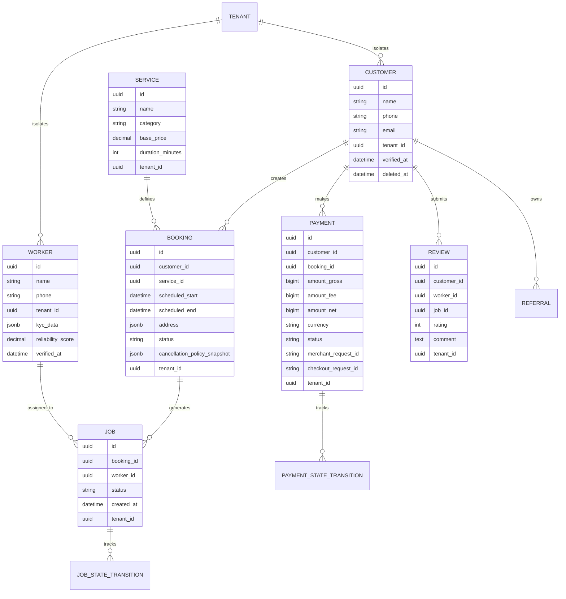
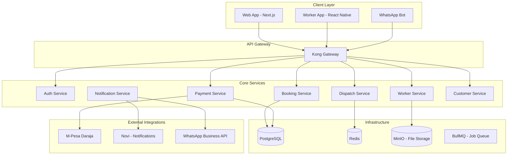
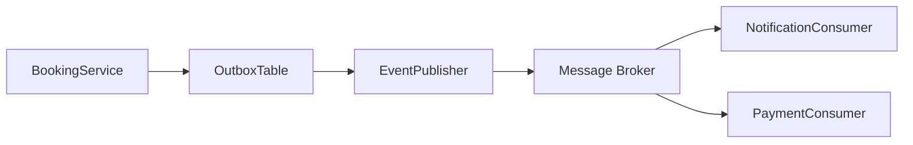
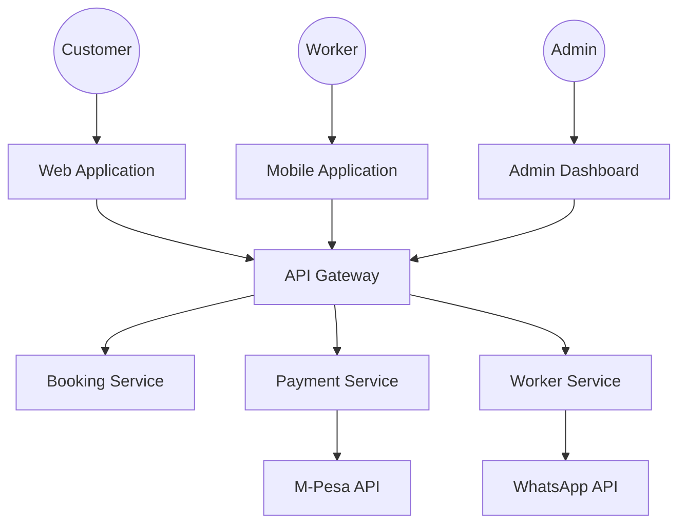
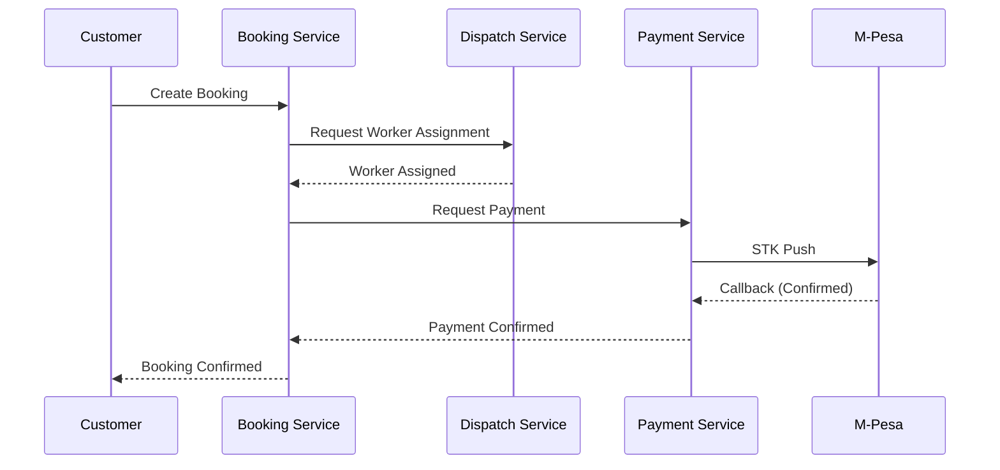

# ServiceOps — Enterprise Architecture Document

## Executive Summary

ServiceOps is a unified field-service operations platform targeting the Kenyan and East African market, designed to power a portfolio of on-demand and scheduled household and professional services. The platform will initially launch with cleaning services and domestic staff placement, then scale to caregiving, pest control, security, and property maintenance. The long-term vision is to merge ServiceOps into **MobiWave Core**, a multi-product technology backbone capable of supporting multiple service verticals under a single identity, billing, and operations infrastructure.

The architecture is designed as a **cloud-native, event-driven, multi-tenant system** with strict separation of concerns between scheduling, dispatch, payments, notifications, and core business logic. External systems (M-Pesa, WhatsApp, email, push) are treated as unreliable third parties; all critical business state changes are managed through internal state machines with eventual consistency guarantees.

---

## Problem Analysis

### Current Market Gaps
1. **Fragmentation:** Cleaning, laundry, and household staffing are managed via WhatsApp groups and informal networks. No unified platform exists to manage discovery, booking, dispatch, payment, and quality assurance.
2. **Payment Friction:** Cash-on-delivery is still dominant. Digital payment adoption is growing but trust in mobile money APIs (M-Pesa) requires robust handling of timeouts, retries, and reconciliations.
3. **Trust Deficit:** Customers need verified, rated workers. Workers need guaranteed payment and dispute resolution. A transparent ratings and escrow system is absent.
4. **Operational Inefficiency:** Manual dispatch, manual payroll, and manual dispute resolution prevent scaling beyond a handful of workers per supervisor.

### Technical Problems to Solve
1. **Idempotency:** M-Pesa callbacks are not idempotent. Safaricom will retry. Systems must handle duplicate callbacks without double-crediting.
2. **Concurrency:** Two customers cannot book the same cleaner for the same time slot. This is a hard business rule.
3. **Offline Workers:** Cleaners operate on 3G with low battery. The system must function gracefully when workers go offline mid-job.
4. **Data Privacy:** Kenya Data Protection Act 2019 mandates strict handling of PII, right to erasure, and security of processing.

---

## Functional Requirements

### Core Functionalities
| ID | Requirement | Priority |
|----|-------------|----------|
| FR-001 | Customer registration and profile management | Must Have |
| FR-002 | Worker registration, KYC, and background check tracking | Must Have |
| FR-003 | Service catalog management (cleaning, laundry, etc.) | Must Have |
| FR-004 | Real-time booking with availability checks | Must Have |
| FR-005 | Worker assignment engine (manual + automatic) | Must Have |
| FR-006 | M-Pesa STK Push integration for payments | Must Have |
| FR-007 | WhatsApp bot for booking and status updates | Must Have |
| FR-008 | Worker mobile app for job acceptance and status updates | Must Have |
| FR-009 | Admin dashboard for operations and dispatch | Must Have |
| FR-010 | Customer portal for booking history and payments | Must Have |
| FR-011 | Ratings and reviews system | Should Have |
| FR-012 | Referral and loyalty program | Should Have |
| FR-013 | Recurring/subscription bookings | Should Have |
| FR-014 | Multi-tenant support (for future B2B agencies) | Could Have |

### Booking State Machine
```
PENDING → CONFIRMED → ASSIGNED → ACCEPTED → EN_ROUTE → IN_PROGRESS → COMPLETED
   ↓          ↓           ↓          ↓          ↓            ↓
CANCELLED   REFUNDED   DECLINED   NO_SHOW   STALLED   DISPUTED
```

---

## Non-Functional Requirements

| ID | Requirement | Target |
|----|-------------|--------|
| NFR-001 | Availability | 99.9% uptime (8.76 hours downtime/year) |
| NFR-002 | Latency | API response < 200ms (p95) |
| NFR-003 | Throughput | 1,000 bookings/day initial, 100,000/day at scale |
| NFR-004 | Data Residency | All PII stored in Kenya, backups in EU |
| NFR-005 | Compliance | Kenya Data Protection Act 2019, PCI-DSS (for M-Pesa) |
| NFR-006 | Auditability | Immutable audit log for all state changes |
| NFR-007 | Scalability | Horizontal scaling of stateless services |
| NFR-008 | Disaster Recovery | RPO < 1 hour, RTO < 4 hours |

---

## Domain Model

The domain is organized around the core concept of a **Job**, which represents the execution of a service by a worker for a customer.



---

## Service Architecture

The platform follows a **modular monolith** pattern for the MVP, transitioning to a **distributed services** pattern as the product mtrjectories mature.



---

## Database Design

### PostgreSQL
- **Multi-tenant by default:** Every table has `tenant_id UUID NOT NULL`
- **Row-Level Security (RLS):** Enforced at the database layer using `current_setting('app.tenant_id')`
- **Audit Table:** Every state change on `jobs`, `payments`, and `bookings` is logged to an `audit_log` table
- **Exclusion Constraints:** Prevent double-booking of workers using `EXCLUDE USING gist`

### Redis
- **Session store:** For auth tokens and OTP validation
- **Rate limiting:** API gateway throttling
- **BullMQ queue:** Background job processing

---

## Event Model

The system is designed around an **event-driven outbox pattern**. Every service writes events to an `outbox` table in the same transaction as the business state change. A background worker polls the outbox and dispatches to message consumers.



### Key Events
| Event | Producer | Consumers |
|-------|----------|-----------|
| `BookingCreated` | Booking Service | Notification Service, Dispatch Service |
| `WorkerAssigned` | Dispatch Service | Notification Service, Worker App |
| `PaymentConfirmed` | Payment Service | Booking Service, Notification Service |
| `JobCompleted` | Worker Service | Payment Service, Review Service |

---

## API Design

### RESTful API
- **Versioning:** `/api/v1/...`
- **Content negotiation:** `application/json`
- **Authentication:** JWT tokens via Keycloak
- **Rate limiting:** 100 requests/minute per API key

### Key Endpoints
| Endpoint | Method | Description |
|----------|--------|-------------|
| `/api/v1/bookings` | POST | Create a new booking |
| `/api/v1/bookings/{id}/confirm` | POST | Confirm a booking |
| `/api/v1/workers/{id}/jobs` | GET | Get jobs for a worker |
| `/api/v1/payments/mpesa/stkpush` | POST | Initiate M-Pesa STK Push |
| `/api/v1/webhooks/mpesa/callback` | POST | M-Pesa callback handler |

---

## Security Architecture

1. **Authentication & Authorization:** Keycloak for SSO, RBAC, and staff permissions
2. **Data Encryption:**
   - **In transit:** TLS 1.3
   - **At rest:** AES-256 encryption for database and file storage
3. **Payment Security:** PCI-DSS compliant handling of M-Pesa credentials. No card data stored.
4. **API Security:** Rate limiting, input validation, CORS, and OWASP Top 10 mitigation
5. **Data Privacy:** Soft deletes, PII scrubbing, and audit trails for compliance with Kenya DPA 2019

---

## Mermaid Diagrams

### System Context


### Data Flow: Booking to Payment


---

## Open Source Recommendations

| Component | Technology | Rationale |
|-----------|------------|-----------|
| API Gateway | Kong | Open source, lightweight, Kong Mesh for service mesh |
| Authentication | Keycloak | Enterprise-grade, battle-tested, supports SSO |
| Database | PostgreSQL 15 | Reliability, JSONB support, RLS |
| Message Broker | Apache Kafka | High throughput, event sourcing, stream processing |
| Background Jobs | BullMQ (Node.js) | Built on Redis, rate limiting, job priorities |
| File Storage | MinIO | S3-compatible, self-hosted, zero vendor lock-in |
| Web Frontend | Next.js | React, SSR, API routes |
| Worker Mobile | React Native | Cross-platform, native performance |
| Admin Dashboard | Budibase | Low-code, connects to APIs |

---

## Build vs Buy Analysis

| Component | Decision | Justification |
|-----------|----------|---------------|
| CRM (Twenty CRM) | **Build** | Simple data model; external CRM adds integration overhead |
| Scheduling (Cal.com) | **Buy** | Complex scheduling logic is not a core differentiator |
| Notifications (Novu) | **Buy** | Multi-channel delivery (SMS, Email, Push) is complex |
| Payment Gateway | **Buy** | M-Pesa is an regulated monopoly; no viable open source |
| Admin Dashboard | **Build (Budibase)** | Internal ops tools should be customizable |
| Mapping/Routing | **Buy (OSRM)** | Routing is a solved problem |

---

## Technical Risks

| Risk | Impact | Mitigation |
|------|--------|------------|
| M-Pesa API instability | High | Outbox pattern, transaction status polling, nightly reconciliation |
| Worker app offline | Medium | Offline-first architecture, heartbeat, manual state override |
| Database deadlocks | High | Optimistic locking, advisory locks, query optimization |
| Data privacy fines | High | Compliance-by-design, audit logs, encryption |
| Multi-tenant data leak | Critical | RLS, middleware isolation, automated cross-tenant tests |

---

## Phase-by-Phase Roadmap

### Phase 1: MVP (Weeks 1-4)
- PostgreSQL schema with RLS
- Next.js web app (Customer portal)
- Express API (Booking, Payment, Worker)
- M-Pesa integration
- WhatsApp notifications
- Worker mobile app (basic)

### Phase 2: Scale (Weeks 5-8)
- Kafka for event-driven architecture
- BullMQ for background jobs
- Admin dashboard (Budibase)
- Recurring bookings
- Referral system

### Phase 3: Mature (Weeks 9-12)
- Multi-tenancy
- Service expansion (laundry, caregiving)
- Advanced dispatch (OSRM)
- Analytics (PostHog)
- Disaster recovery

### Phase 4: MobiWave Core (Months 4-6)
- Identity service abstraction
- Unified billing
- Cross-product analytics
- White-label capabilities
